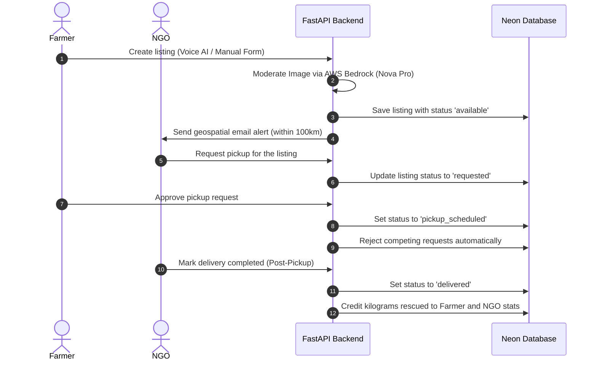

# 🚜 FarmShare

> **Connecting Surplus Produce Directly to Food Banks & NGOs to Reduce Food Waste.**

[](https://core-4.razadev.online)
[](https://api.razadev.online/docs)

---

## 📌 Links
* 🌐 **Live Web Application:** [https://core-4.razadev.online](https://core-4.razadev.online)
* 📖 **Backend API Documentation (Swagger):** [https://api.razadev.online/docs](https://api.razadev.online/docs)

---

## 📖 Problem Statement
Every day, tonnes of fresh, perfectly edible farm produce are discarded or left to rot in fields due to minor cosmetic flaws or logistical coordination gaps. Meanwhile, nearby local communities and food banks face severe food insecurity and hunger.

### Objective
Develop a sustainable, highly-interactive platform that helps farmers list and distribute surplus produce directly to nearby food banks and NGOs, reducing food waste and ensuring fresh food reaches those who need it most.

---

## 🌟 Core Features

1. **🎙️ HarvestLink Multilingual Voice AI**
   * Bypasses digital literacy barriers by letting farmers list crops using regional voice inputs (**English, Hindi, Marathi, Telugu, Kannada**).
   * Powered by browser-native Speech Recognition (Web Speech API) and structured parsing via **AWS Bedrock (Amazon Nova Pro)**.
   * Auto-populates forms and translates regional produce names (e.g., *"प्याज"* to *"Onion"*) and relative dates.

2. **⚡ Smart Match Logistics Engine**
   * Evaluates and ranks matching scores (0–100%) for NGOs dynamically.
   * Leverages the **Haversine formula** to calculate straight-line distances and weighs factors like freshness, quantity, and availability.

3. **🛡️ AI Image Moderation**
   * Prevents spam and irrelevant listings by evaluating uploaded image bytes using **AWS Bedrock Nova Pro** to verify the image contains food or fresh produce before saving.

4. **🗺️ Interactive Map View**
   * Integrates **Leaflet.js** and **OpenStreetMap** to overlay active crop locations (green pins) and registered NGOs (blue pins) for routing visibility.

5. **📧 Geospatial Alerts**
   * Automatically triggers background SMTP email alerts to NGOs within a 100km radius of newly created crop listings.

6. **📱 Cross-Platform Mobile Application**
   * Features a complete mobile client built with **React Native (Expo)** to track real-time locations and navigate donation lifecycles on the go.

---

## 🛠️ Technology Stack

| Layer | Technologies Used |
| :--- | :--- |
| **Backend** | Python, FastAPI, raw `psycopg2` SQL queries |
| **Database** | Serverless Neon PostgreSQL |
| **Frontend** | HTML5, Vanilla CSS (Glassmorphism), ES6 JavaScript, Leaflet.js |
| **Mobile** | React Native, Expo, React Navigation, WebView Mapping |
| **Cloud & APIs** | AWS Bedrock (Nova Pro), Cloudinary, SMTP Mail Server |

---

## 📂 Directory Structure

```text
Team-Core-4/
├── app/                  # FastAPI Backend Code
│   ├── models/           # Database Models
│   ├── routers/          # API Routers (auth, produce, upload, smart_match, etc.)
│   ├── database.py       # Raw psycopg2 Neon DB Connection Pool
│   ├── main.py           # Application Entry Point
│   └── dependencies.py   # JWT & Role-Based Auth Verification
├── frontend/             # Single-Page Web Dashboard
│   ├── index.html        # Web Application Layout
│   ├── index.css         # Premium Glassmorphism CSS Design
│   ├── app.js            # Frontend State, Map, and Auth Routing
│   └── translations.js   # Dynamic i18n Localization Engine
├── mobile/               # React Native Expo Mobile App
│   ├── src/              # Source Files (Screens, Components, API Clients)
│   ├── App.js            # Mobile Entry Point
│   └── app.json          # Expo App Configuration
├── requirements.txt      # Python Dependencies
└── README.md             # Project Documentation
```

---

## ⚙️ Local Development Setup

### 1. Prerequisites
* Python 3.10+
* Node.js & npm (for Mobile/Expo development)

### 2. Backend Setup
1. Clone the repository and navigate to the project directory.
2. Create and activate a virtual environment:
   ```bash
   python -m venv venv
   source venv/bin/activate  # On Windows: venv\Scripts\activate
   ```
3. Install the dependencies:
   ```bash
   pip install -r requirements.txt
   ```
4. Create a `.env` file from the example:
   ```bash
   cp .env.example .env
   ```
5. Set your environment variables:
   * `DATABASE_URL`: Neon Postgres Connection String
   * `AWS_ACCESS_KEY_ID`, `AWS_SECRET_ACCESS_KEY`, `AWS_REGION`: AWS credentials for Bedrock (Nova Pro)
   * `CLOUDINARY_URL`: Cloudinary credentials for image storage
   * `SMTP_USER`, `SMTP_PASSWORD`, `SMTP_HOST`, `SMTP_PORT`: Email settings for alerts
6. Run the FastAPI development server:
   ```bash
   uvicorn app.main:app --reload
   ```
   * Open [http://127.0.0.1:8000/docs](http://127.0.0.1:8000/docs) in your browser to view the interactive API docs.

### 3. Frontend Web Setup
1. The frontend consists of static files in the `/frontend` directory.
2. You can serve them using any local web server. For example:
   ```bash
   cd frontend
   python -m http.server 8080
   ```
3. Open [http://127.0.0.1:8080](http://127.0.0.1:8080) in your browser.
4. Ensure the backend API endpoint points to your local backend in `app.js`:
   ```javascript
   const API_BASE_URL = 'http://127.0.0.1:8000';
   ```

### 4. Mobile Setup
1. Navigate to the mobile directory:
   ```bash
   cd mobile
   ```
2. Install dependencies:
   ```bash
   npm install
   ```
3. Run the Expo development server:
   ```bash
   npx expo start
   ```
4. Scan the QR code with the Expo Go app on your physical iOS or Android device.

---

## 🔄 Donation Lifecycle Flow



---

## 👥 Contributors
* **Team Core4**
