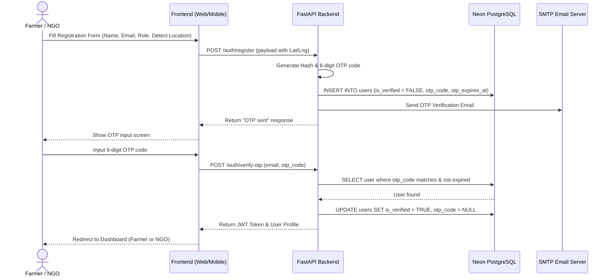
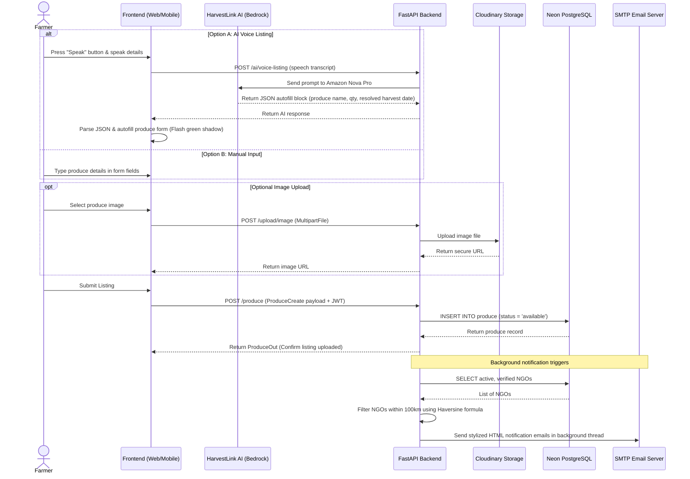
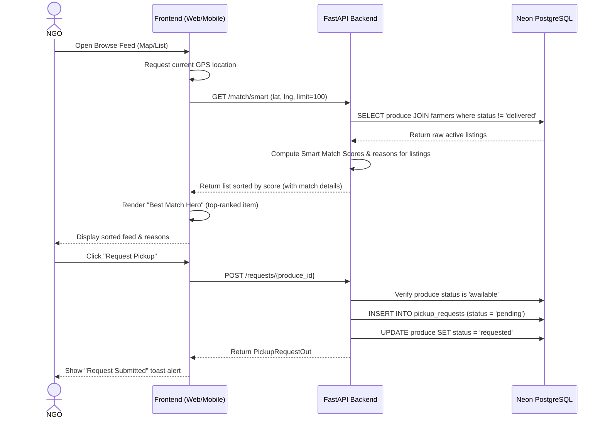
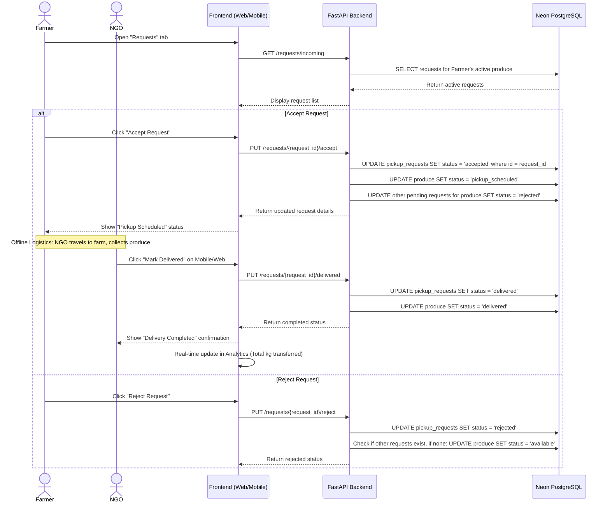
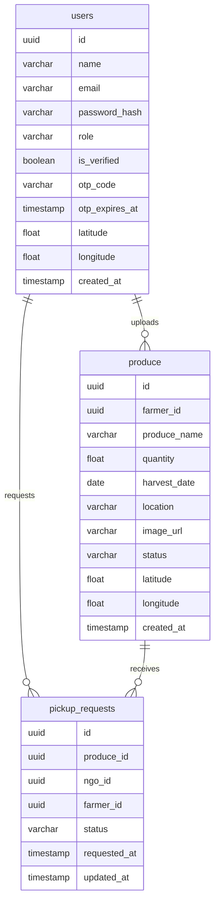

# 🌾 FarmShare: Simplified Presentation Guide

This guide describes the core features of **FarmShare** in simple, non-technical words, along with an explanation of how the **FastAPI Backend** makes them work behind the scenes.

---

## 💡 Platform Models & Terminology (In Simple Words)

When presenting, you can explain the core technical concepts of the system using these plain-English definitions:

| Technical Term | What it is (in Simple Words) | Why we need it |
| :--- | :--- | :--- |
| **User (`users` database)** | A profile representing a participant on the platform. Can be a **Farmer** (food donor) or an **NGO / Food Bank** (food recipient). | To know who is giving food, who is receiving food, and where they are physically located. |
| **Email Verification (`otp_code`)** | A security check that sends a temporary 6-digit code to the user's email inbox during sign-up. | To verify that the email address is real and belongs to a real person, preventing fake accounts and spam. |
| **Surplus Listing (`produce` database)** | A digital entry representing a batch of excess food a farmer wants to give away (e.g., *"200 kg of fresh potatoes"*). | To show what food is available, its harvest date (freshness), location, and whether it has already been claimed. |
| **Pickup Request (`pickup_requests`)** | A digital "hand-raise" ticket created when an NGO clicks *"Request Pickup"* to claim a farmer's food listing. | To coordinate matching. It allows farmers to see which NGOs want the food, choose one to schedule, and ignore duplicates. |
| **Smart Match Score** | A matching rating from 0% to 100% calculated automatically by the backend. | It highlights the best listings for an NGO: higher percentage means the food is closer to their location, fresher, and available in larger quantities. |
| **Haversine Distance Engine** | A built-in calculator that computes the straight-line distance in kilometers between two sets of GPS coordinates. | To filter notifications and lists (e.g., only email NGOs within a 100 km radius of a new farm listing to prevent long-distance logistics issues). |

---

## 🚀 5 Core Features Explained Simply

Here is a breakdown of the platform's features, written in plain English, explaining how the **FastAPI Backend** powers them:

### 1. Multi-Lingual AI Assistant (HarvestLink AI)
* **In Simple Words:** An AI chatbot helper that speaks 5 local languages: **English**, **Hindi (हिंदी)**, **Marathi (मराठी)**, **Telugu (తెలుగు)**, and **Kannada (ಕನ್ನಡ)**. A farmer can press a button, say what surplus food they have (e.g., *"I have 200 kg of fresh onions harvested today in Pune"*), and the AI automatically fills out the upload form for them. It also answers questions about food storage, shelf life, and donation rules.
* **How FastAPI Backend Works:** 
  1. The browser records the farmer's voice using the built-in Web Speech API and turns it into text.
  2. The text is sent to the FastAPI backend (`/ai/voice-listing` endpoint).
  3. The backend sends the text to **AWS Bedrock (Amazon Nova Pro LLM)**.
  4. The AI translates regional food names (e.g., "कांदा" to "Onion"), changes relative dates like "today" to a calendar date (e.g., `2026-06-27`), and returns a small structured text packet.
  5. FastAPI returns this clean data back to the frontend, which instantly fills the input fields on the screen and flashes green to show it was successful.

### 2. Smart Match Logistics Engine
* **In Simple Words:** Instead of showing lists of food in random order, the platform automatically ranks listings for NGOs using a matching score from **0% to 100%**. A high percentage score means the food is very close to the NGO, fresh, and available in a large quantity.
* **How FastAPI Backend Works:**
  1. When an NGO opens the app, the frontend grabs their GPS location and sends it to the FastAPI backend (`/match/smart` endpoint).
  2. The backend looks up all active food listings in the database.
  3. It runs a quick Python math formula (**Haversine formula**) using the GPS coordinates to calculate the exact distance in kilometers between the NGO and each farm.
  4. It combines **Distance (40% weight)**, **Food Age (35% weight)**, and **Quantity (15% weight)** to calculate a combined rating.
  5. The backend sorts the results so the highest matching listing is shown first, accompanied by clear descriptions (e.g. *"Just 2.3 km away — very close"*).

### 3. Immediate Alerts (Geospatial Notifications)
* **In Simple Words:** When a farmer lists new food on the platform, the system immediately finds all verified, active NGOs registered within **100 kilometers** of that farm and sends them a designed alert email. This allows NGOs to claim the fresh food before it spoils.
* **How FastAPI Backend Works:**
  1. When a farmer submits a new listing, the FastAPI backend receives the request.
  2. Before finishing, the backend spawns a **background task** (a separate background process so the farmer's screen doesn't lag).
  3. The background task fetches all verified NGOs from the database.
  4. It filters the NGOs list, keeping only those within 100 kilometers using their GPS coordinates.
  5. It builds a beautiful HTML email and sends it out to each nearby NGO using a Gmail SMTP service connection.

### 4. Interactive Geolocation Map View
* **In Simple Words:** A map that shows where everyone is. Farmers with active food are shown as green pins (with details on food name, quantity, and status in a pop-up), and NGOs are shown as blue pins.
* **How FastAPI Backend Works:**
  1. The FastAPI backend has a simple endpoint (`/map/data`).
  2. When called, it executes a database query that joins the `produce` and `users` tables to fetch the GPS coordinates and names of active listings and verified NGOs.
  3. It returns this list of coordinates.
  4. The web dashboard and mobile app parse this coordinate list and render them as icons on an interactive **Leaflet.js / OpenStreetMap** map widget.

### 5. Automated Pick-up Lifecycle Tracker
* **In Simple Words:** A digital coordinator that guides a donation from start to finish through four clear stages:
  1. **Available:** Farmer posts surplus food.
  2. **Requested:** An NGO clicks *"Request Pickup"* to claim it.
  3. **Pickup Scheduled:** The farmer reviews the request and clicks *"Accept"*. The system automatically rejects other pending requests for that item.
  4. **Delivered:** The NGO picks up the food and marks it as completed.
* **How FastAPI Backend Works:**
  1. The backend tracks the status of listings and requests in the database using the `/requests` router.
  2. When an NGO requests a listing, FastAPI changes the produce state from `'available'` to `'requested'`.
  3. When a farmer accepts, FastAPI updates the request state to `'accepted'`, changes the produce state to `'pickup_scheduled'`, and automatically runs a query to update other competing pending requests for that produce item to `'rejected'`.
  4. When the NGO marks it as received, FastAPI updates the states to `'delivered'` and automatically updates the analytics engine (adding the weight of the produce to the farmer's total donated kilograms and the NGO's received kilograms).

---

## 🔄 End-to-End System Workflows

Here is the complete step-by-step operational lifecycle of the FarmShare platform, from onboarding to donation completion:

### 1. Registration & Email Verification (OTP Flow)

---

### 2. Farmer Surplus Listing Flow (Manual & AI-Voice)

---

### 3. Smart Matching & Pickup Request Flow

---

### 4. Farmer Approval & Delivery Closing Flow

---

## 🗄️ Database Schema & Data Models

The database consists of three core tables managed inside **PostgreSQL**:

---

## 🚀 Live Services & Deployment

* **Backend Production API:** Hosted on AWS EC2 at `http://13.234.42.87:8000` (Swagger docs available at `/docs`).
* **Database Platform:** Neon Serverless PostgreSQL.
* **AI Runtime:** AWS Bedrock proxy service.
* **Storage Provider:** Cloudinary.
